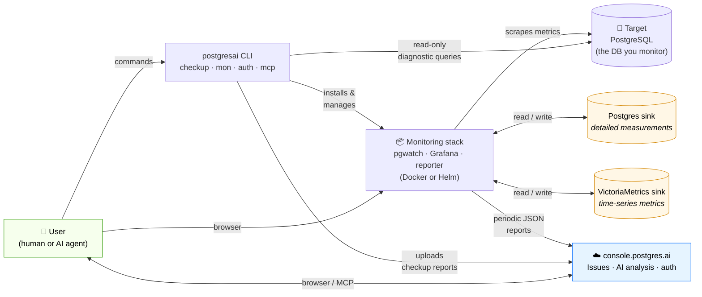

# Architecture

Two views of the `postgresai` system: a high-level data-flow view showing **who talks to what**, and a more detailed view showing the individual components inside the monitoring stack.

Both diagrams use Mermaid and render directly on GitHub/GitLab.

---

## 1. High-level view

Shows the main actors, the two storage backends, and how data flows between them.

**Key points**

- One CLI is the entry point for both modes: **express checkup** (one-shot) and **full monitoring** (continuous).
- The stack uses **two storages** with different shapes:
  - **Postgres sink** — stores rich measurement rows (used by the Flask API and some Grafana panels).
  - **VictoriaMetrics** — Prometheus-compatible time-series store (used by most Grafana dashboards and the reporter).
- The cloud (`console.postgres.ai`) is **optional**: express checkup supports `--no-upload`, and the monitoring stack runs without an API key.

---

## 2. Component view

Same system, expanded to show the individual containers/services and how they wire up.

```mermaid
flowchart TB
    %% --- USER SIDE ---
    subgraph UserSide["👤 User side"]
        direction TB
        Dev["Developer / AI agent"]
        IDE["AI IDE<br/>Claude Code · Cursor · Windsurf"]
        Plugin["Claude Code plugin<br/>+ MCP server"]
        CLI["postgresai CLI<br/>(Node/Bun)<br/>checkup · mon · auth · mcp · prepare-db"]
    end

    %% --- TARGETS ---
    subgraph TargetSide["🐘 Target databases (PG 14–18)"]
        direction TB
        TargetPG[("target Postgres<br/>+ pg_stat_statements<br/>+ postgres_ai schema")]
        Standby[("optional standby")]
    end

    %% --- MONITORING STACK ---
    subgraph Stack["📦 Monitoring stack — Docker Compose / Helm"]
        direction TB

        subgraph Collect["Collection"]
            direction LR
            PgwPG["pgwatch-postgres<br/><i>detailed metrics</i>"]
            PgwVM["pgwatch-prometheus<br/><i>time-series metrics</i>"]
        end

        subgraph Storage["Storage"]
            direction LR
            SinkPG[("sink-postgres<br/>measurements DB")]
            SinkVM[("sink-prometheus<br/>VictoriaMetrics")]
        end

        subgraph Serve["Serving / consumption"]
            direction LR
            Grafana["Grafana<br/>13+ expert dashboards"]
            Flask["monitoring_flask_backend<br/>pg_stat_statements API"]
            Reporter["postgres-reports<br/>(reporter, Python)<br/>periodic JSON reports"]
        end

        subgraph Self["Self-monitoring"]
            direction LR
            CAdv["cAdvisor"]
            Node["node-exporter"]
            PGExp["postgres-exporter"]
        end
    end

    %% --- CLOUD ---
    Cloud["☁️ console.postgres.ai<br/>Issues · AI analysis · auth · report storage"]

    %% --- EDGES: user side ---
    Dev --> CLI
    Dev --> IDE
    IDE --> Plugin
    Plugin -->|MCP / HTTPS| Cloud
    CLI -->|OAuth PKCE| Cloud

    %% --- EDGES: checkup path ---
    CLI -->|"read-only<br/>diagnostic SQL"| TargetPG
    CLI -->|"upload checkup JSON<br/>(optional)"| Cloud
    CLI -->|installs · starts · upgrades| Stack

    %% --- EDGES: collection ---
    PgwPG -->|scrape ~60s| TargetPG
    PgwVM -->|scrape ~60s| TargetPG
    PgwPG -->|write| SinkPG
    PgwVM -->|remote_write| SinkVM

    %% --- EDGES: serving ---
    Grafana -->|SQL| SinkPG
    Grafana -->|PromQL| SinkVM
    Flask -->|SQL| SinkPG
    Flask -->|PromQL| SinkVM
    Reporter -->|PromQL| SinkVM
    Reporter -->|"upload JSON<br/>(optional)"| Cloud

    %% --- EDGES: self-monitoring ---
    CAdv -->|metrics| SinkVM
    Node -->|metrics| SinkVM
    PGExp -->|metrics| SinkVM
    PGExp -.->|scrapes| SinkPG

    %% --- EDGES: humans hitting the stack ---
    Dev -->|browser :3000| Grafana
    Dev -.->|HTTP API| Flask

    %% --- styling ---
    classDef storage fill:#fff7e6,stroke:#d48806,color:#000
    classDef cloud fill:#e6f4ff,stroke:#1677ff,color:#000
    classDef target fill:#f9f0ff,stroke:#722ed1,color:#000
    class SinkPG,SinkVM storage
    class Cloud cloud
    class TargetPG,Standby target
```

### Component cheat sheet

| Component | Role |
|---|---|
| **postgresai CLI** | Entry point. Runs checkups, installs the stack, manages targets, MCP install, auth. |
| **Target Postgres** | The database being observed. `prepare-db` creates a read-only `postgres_ai_mon` user and the `postgres_ai` helper schema. |
| **pgwatch-postgres** | pgwatch v3 instance writing detailed measurement rows into the Postgres sink. |
| **pgwatch-prometheus** | pgwatch v3 instance exposing time-series metrics scraped into VictoriaMetrics. |
| **sink-postgres** | Postgres database (`measurements`) holding rich, structured metric rows. |
| **sink-prometheus** | VictoriaMetrics — Prometheus-compatible TSDB. Default 14-day retention. |
| **Grafana** | 13+ expert dashboards (Node Overview, Query Analysis, Wait Events, Indexes, Tables, Replication, …). Reads from both sinks. |
| **monitoring_flask_backend** | HTTP API for `pg_stat_statements`-derived views consumed by Grafana panels. |
| **postgres-reports (reporter)** | Python service generating periodic JSON health reports; can upload to `console.postgres.ai`. |
| **Self-monitoring** | cAdvisor (containers), node-exporter (host), postgres-exporter (sink-postgres) → VictoriaMetrics. |
| **console.postgres.ai** | Managed cloud: Issues workflow, AI analysis, history, MCP backend. Optional. |
| **MCP server** | Bridges AI IDEs (Claude Code, Cursor, Windsurf) to Issues and action items in the cloud. |

### Two storages — why both?

- **VictoriaMetrics** is optimized for high-cardinality time-series and PromQL — the right shape for dashboards and trend reports.
- **sink-postgres** keeps richer, structured rows (e.g. full `pg_stat_statements` snapshots) that are awkward to model as time series and are easier to query with SQL from the Flask API.

Both are populated independently by their own pgwatch instance, so one can be disabled without affecting the other.
