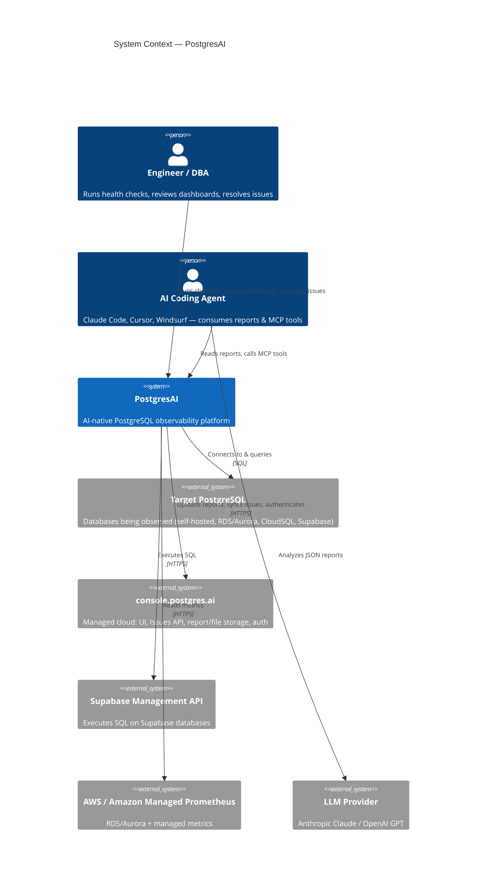
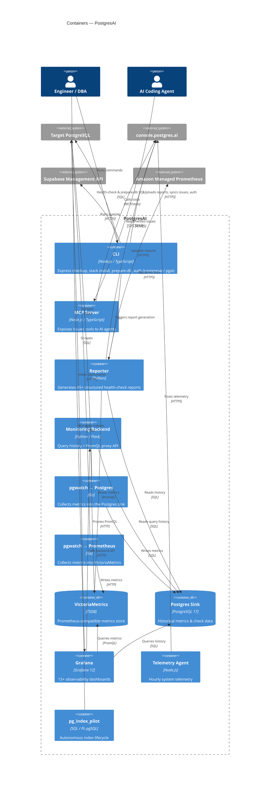
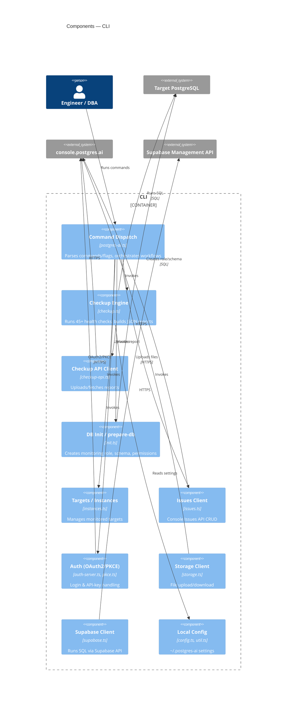
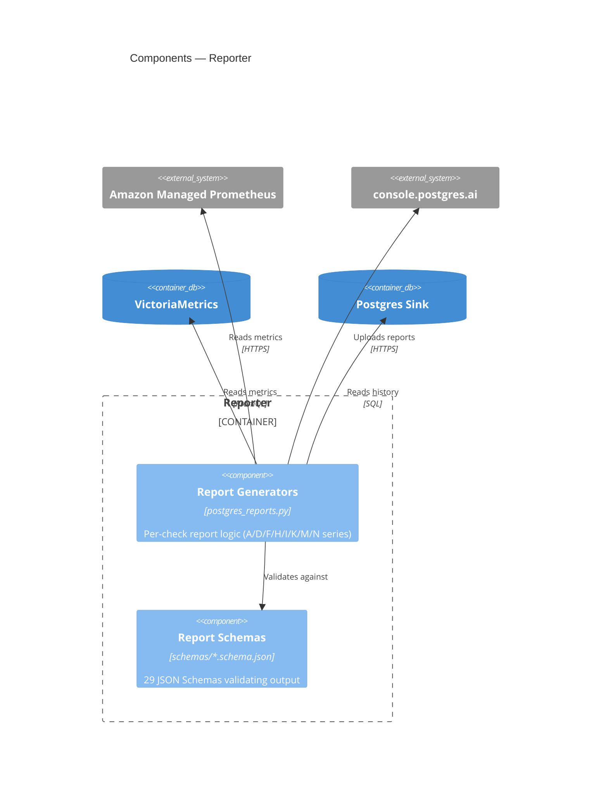

# PostgresAI — C4 Architecture Model

This directory holds the [C4 model](https://c4model.com/) for PostgresAI, an
AI-native PostgreSQL observability platform (monitoring, health checks, and root
cause analysis).

The model is maintained in two complementary forms:

| File | Purpose |
|------|---------|
| [`workspace.dsl`](./workspace.dsl) | **Source of truth.** [Structurizr DSL](https://docs.structurizr.com/dsl) describing people, systems, containers, components and their relationships. Renders all C4 levels and stays in sync as a single definition. |
| `README.md` (this file) | GitHub-renderable [Mermaid](https://mermaid.js.org/syntax/c4.html) diagrams for quick reading without tooling. |

The C4 model describes architecture at four levels of zoom: **System Context**
(L1) → **Containers** (L2) → **Components** (L3) → Code (L4, left to the source).

## How to view the Structurizr model

```bash
# Render/edit interactively with Structurizr Lite
docker run -it --rm -p 8080:8080 \
  -v "$(pwd)/docs/architecture:/usr/local/structurizr" \
  structurizr/lite
# then open http://localhost:8080
```

---

## Level 1 — System Context

How PostgresAI fits among its users and the external systems it talks to.



---

## Level 2 — Containers

The separately deployable/runnable units inside PostgresAI. The CLI delivers the
zero-setup express checkup; the rest form the optional full monitoring stack
(`docker-compose.yml` / Helm chart).



---

## Level 3 — Components: CLI

The CLI is the primary entry point and the most component-rich container
(`cli/lib/*.ts`).



---

## Level 3 — Components: Reporter



---

## Maintaining this model

- Treat `workspace.dsl` as the source of truth; update it when containers,
  components, or integrations change.
- Keep the Mermaid diagrams above in sync for at-a-glance reading on GitHub.
- Useful references: [c4model.com](https://c4model.com/),
  [Structurizr DSL docs](https://docs.structurizr.com/dsl),
  [Mermaid C4 syntax](https://mermaid.js.org/syntax/c4.html).
